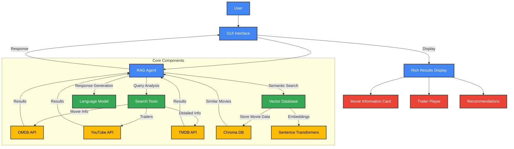
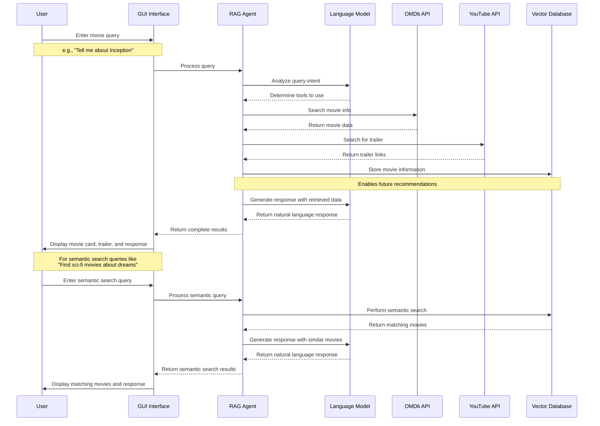

# Movie Research RAG Agent


## Overview

I created a Movie Research Assistant application that helps users find information about movies and TV shows. The system uses Retrieval Augmented Generation (RAG) to provide accurate and up-to-date information by combining AI language models with real-time data from movie databases and YouTube.

## Features

- **Movie Information Lookup**: Search for details about any movie including directors, cast, ratings, and plot summaries
- **Trailer Search**: Find official trailers for movies on YouTube 
- **Semantic Search**: Find movies by themes, genres, or similar concepts
- **Movie Recommendations**: Get suggestions for similar movies
- **Conversation Interface**: Chat naturally with the AI assistant about movies
- **Vector Database**: Stores movie information for fast semantic retrieval
- **Rich User Interface**: Displays movie posters, details, and trailer links

## Architecture

I designed this system with a modular architecture that separates concerns and allows for easy extension:

### 1. Core Components

- **RAG Agent**: The central coordinator that processes user queries, calls appropriate tools, and generates responses
- **Search Tools**: Connect to external APIs to retrieve movie data and trailers
- **Vector Store**: A local database that enables semantic search and recommendations
- **GUI**: A user-friendly interface for interacting with the system

### 2. Architecture Diagram



### 3. Data Flow Diagram



## Data Flow

When a user asks a question:
1. The query goes to the RAG agent
2. The agent decides which tools to use (movie search, trailer search, etc.)
3. The tools retrieve information from external APIs
4. New movie information is stored in the vector database
5. The agent generates a response based on the retrieved information
6. The UI displays the response with rich visuals

## Technologies Used

- **Python**: Core programming language
- **LangChain**: Framework for building applications with language models
- **OpenAI API**: Provides the language model capabilities
- **Chroma DB**: Vector database for semantic search
- **PyQt6**: GUI framework for desktop application
- **OMDb API**: Movie information database
- **YouTube Data API**: For finding movie trailers
- **TMDB API**: Additional movie details and posters

## Setup Instructions

### Prerequisites

- Python 3.8 or higher
- API keys for:
  - OpenAI
  - OMDb
  - YouTube Data API
  - TMDB (optional)

### Installation

1. Clone this repository:
   ```
   git clone https://github.com/yourusername/movie-rag-agent.git
   cd movie-rag-agent
   ```

2. Set up a virtual environment (recommended):
   ```
   python -m venv venv
   
   # On Windows
   venv\Scripts\activate
   
   # On macOS/Linux
   source venv/bin/activate
   ```

3. Install required packages:
   ```
   pip install -r requirements.txt
   ```

4. Create a `.env` file with your API keys:
   ```
   OPENAI_API_KEY=your_openai_key_here
   OMDB_API_KEY=your_omdb_key_here
   YOUTUBE_API_KEY=your_youtube_key_here
   TMDB_API_KEY=your_tmdb_key_here  # Optional
   ```

5. Run the application:
   ```
   python main.py
   ```

## Project Structure

```
movie_rag_agent/
├── main.py                 # Application entry point
├── rag_agent.py            # RAG agent implementation
├── search_tools.py         # API integration tools
├── vector_store.py         # Vector database
├── gui.py                  # User interface
├── requirements.txt        # Dependencies
├── .env                    # API keys
└── db/                     # Vector database storage
```

## Challenges and Solutions

### Challenge 1: Data Integration
**Problem**: Integrating multiple data sources (OMDb, YouTube, TMDB) with different data formats.

**Solution**: I created adapter classes for each API that standardize the output format. This made it easier to handle data from different sources and provide a consistent experience to users.

### Challenge 2: Semantic Search Implementation
**Problem**: Implementing semantic search capabilities from scratch would be complex and time-consuming.

**Solution**: I used Chroma DB with Sentence Transformers to handle vector embeddings. This allowed me to focus on the application logic while leveraging existing tools for the complex embedding calculations.

### Challenge 3: Asynchronous UI
**Problem**: The application would freeze during API calls, creating a poor user experience.

**Solution**: I implemented a threaded approach using QThread in PyQt6. This keeps the UI responsive while processing queries and loading images.

### Challenge 4: Vector Database Accuracy
**Problem**: Initial semantic search results weren't as relevant as expected.

**Solution**: I improved the text representation by combining title, director, cast, genre, and plot information into a more comprehensive document for embedding. This created more meaningful vector representations of each movie.

### Challenge 5: API Key Management
**Problem**: Securely managing multiple API keys without hardcoding them.

**Solution**: Implemented environment variable loading with python-dotenv, allowing users to set their API keys in a local `.env` file that isn't committed to version control.

## Future Improvements

1. **Expanded Movie Database**: Integrate with more movie databases for even more comprehensive informa